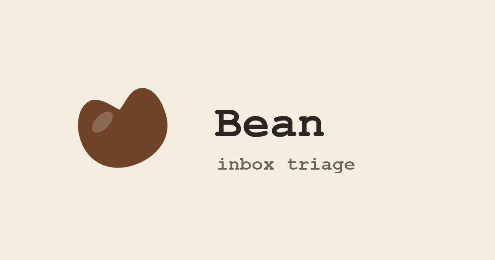
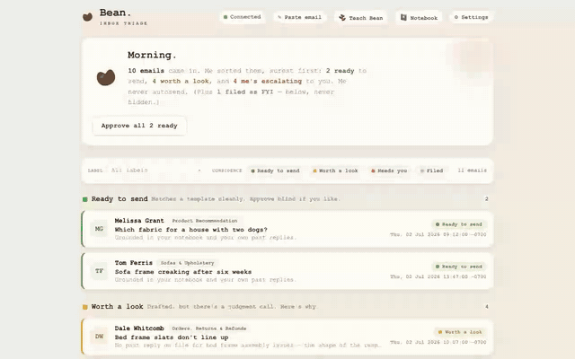

<div align="center">



**An email triage and reply-drafting agent that tells you when it isn't sure.**

[Try the live demo](https://bean-demo-production.up.railway.app) · no signup, no API key

</div>

<!-- Re-recorded 2026-08-10 against the current demo tenant. The previous GIF was pulled because it
     showed the old demo store's product line, which paraphrased a real customer's. Regenerate with
     scripts/record_demo.mjs — never by hand, so it stays reproducible. -->



Bean reads a store's support mail, decides what needs a reply at all, drafts one grounded in the
operator's own notebook, sorts the result by how confident it is, and shows it for one-tap approval.

**Bean never sends.** There is no autosend flag, no trusted-sender bypass, and no confidence
threshold above which it acts alone. A human sends every reply.

## The problem it actually solves

Matching an email to a category and filling in a template is the easy 80%. The product is the other
20% — the mail where there is no clean answer.

An assistant that always returns a confident-looking draft is **worse than no assistant**. The
operator still has to re-read everything to find the drafts that are quietly wrong, so nothing is
saved. The only thing that buys back time is an assistant you can trust to say *"not this one."*

So Bean sorts its own output into three lanes and commits to the label:

|  | what it means | what you do |
|---|---|---|
| 🟢 **Ready to send** | Grounded in something the operator actually wrote. | Approve in one tap. |
| 🟡 **Worth a look** | Drafted, but here is specifically what I couldn't stand behind. | Read the reasons, then decide. |
| 🔴 **Needs you** | I'm not going to invent an answer. | Over to you. |

The yellow lane is the whole design. A draft it can't ground is never dressed up as one it can, and
the reasons are specific — *"the notebook says to ask for order number, email, name and shipping
address; Dale already gave the order number, and I can't confirm whether you'd ask for the rest."*

Every correction feeds the next draft. That loop, not the model, is the product.

## Try it

The demo is a fictional store (Sable & Wren), its notebook, and eleven emails Bean has already triaged.
It needs no API key.

```bash
python3.13 -m venv .venv && source .venv/bin/activate
pip install -r requirements.txt

python scripts/seed_demo_tenant.py
BEAN_CUSTOMER=sablewren BEAN_DEMO_READONLY=1 python -m bean.server   # → http://127.0.0.1:8011
```

Every verdict in that inbox was produced by running those emails through the real engine. A demo
with hand-written confidence labels would be lying about the exact property the project is for — so
when the notebook is thin, the demo shows one green out of ten, and that is left alone.

`BEAN_DEMO_READONLY=1` is a hard write lock: every route that would persist something or spend a
token stops existing, all reads keep working, and whatever a visitor clicks lives in their browser
until they refresh.

## How it connects to mail

You forward your support address to a Postmark inbound-parse address, and Postmark POSTs each
message to `/api/inbound`. That is the entire integration. It works with Gmail, Proton on a custom
domain, Fastmail, or anything else that can forward.

**Bean never holds a mailbox credential, and OAuth is deliberately not implemented.** Reading a
mailbox over OAuth means holding a token that can read all of it, forever. Forwarding gives Bean
exactly the mail you chose to send it, and you revoke it by deleting one rule.

## How it works

```
inbound mail → gate → notebook engine → confidence → your approval
                ↓                            ↓
          filed as FYI              corrections.jsonl ──┐
                                            ▲           │
                                            └───────────┘
                                        (feeds later drafts)
```

**The gate** is a cheap classifier that decides whether an email needs a reply at all. Newsletters,
receipts and shipping notifications are filed without ever reaching the expensive step, so most mail
costs almost nothing. Operators correct its mistakes, and it proposes new filing rules from those
corrections.

**The notebook** is one markdown file in the operator's own words: the buckets they sort mail into,
the cliffs where their answer changes, the facts about their store. Bean drafts against that and
cites which part it leaned on. It is human-readable and model-neutral on purpose — the operator's
judgment shouldn't be locked inside an embedding, or inside a vendor.

**The correction log** is a JSONL file of approvals, edits and rewrites that feeds later drafts as
examples. The operator's edits are the training signal; there is no separate labeling step.

`architecture.html` is the full system map.

## Design constraints

No database, no web framework, no auth service, no build step — a standard-library HTTP server,
JSON and JSONL files on a volume, and React loaded from plain `.jsx` files. React 18.3.1 (MIT) is
the only vendored dependency, checked in rather than installed.

That is a deliberate ceiling, not an accident. Each of those is a thing to add the day something
concrete demands it, and the trigger conditions are written down in the source. Most of them have
not fired.

## Status, honestly

Bean runs **one real store in production** and is shaped around that operator's judgment.

It is published as a worked example — one agent built properly for one real user, with the reasoning
left visible — not as software you can sign up for. `docs/self-serve.md` is the honest map of the
distance between those two things; the short version is that Bean resolves one tenant per process
from an environment variable, and closing that is months, not days.

**Not accepting pull requests.** The design is still moving and the surface that matters is a
notebook Bean can't ship for you. Notes on what broke for you are welcome.

## License

MIT — see [LICENSE](LICENSE).
